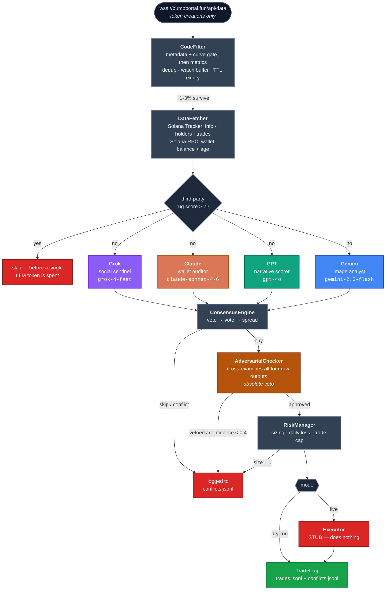
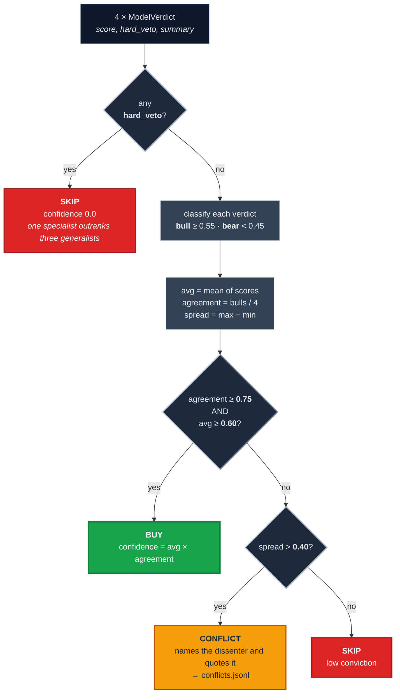
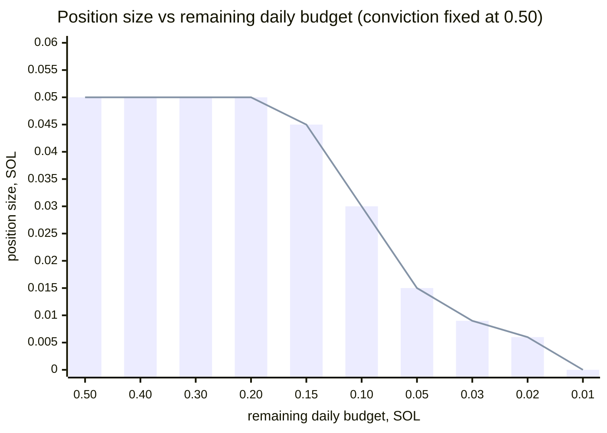
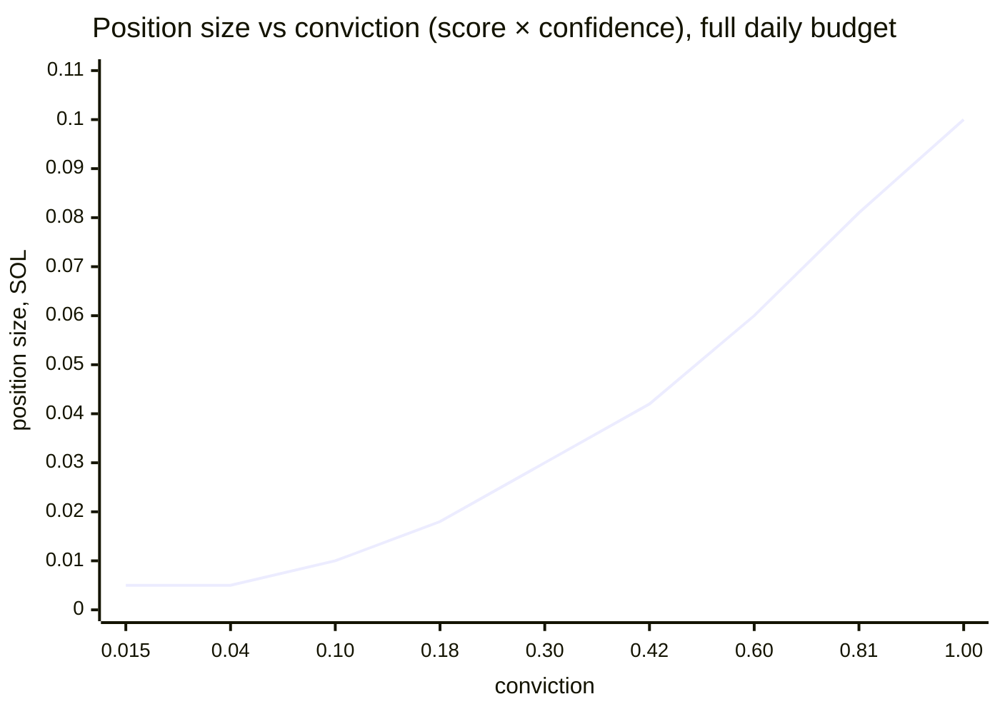

<div align="center">

# grok-claude-gpt-gemini-trading-desk

**Four frontier LLMs look at the same pump.fun launch from four angles they don't share.
A fifth tries to talk them out of it.**

[](https://www.python.org/)
[](tests/)
[](#quick-start)
[](#implementing-the-executor)

[](#the-panel)
[](#the-panel)
[](#the-panel)
[](#the-panel)
[](#the-panel)

</div>

---

A multi-model trading pipeline for pump.fun launches on Solana. It listens to the live
token-creation feed, filters new mints down to the few worth thinking about, and then asks
four different LLMs — Grok, Claude, GPT and Gemini — to examine the *same* launch from four
angles they do not share: social chatter, on-chain wallet forensics, narrative quality, and
the artwork itself.

Their scores go to a consensus engine where any single specialist holds a veto. A surviving
"buy" is handed to a fifth call — an adversarial checker whose only job is to find
contradictions between the other four and talk the panel out of the trade. Every buy, every
skip, every disagreement is written to JSONL, so you can go back afterwards and ask whether
four models were actually worth four API calls.

`src/executor.py` is a stub. This is a research and analysis harness, not a bot that will
trade for you.

## Architecture



The four scoring agents run **concurrently** — they are independent, so the slowest one sets
the round's latency. The checker runs after, because it needs all four outputs to compare.

## Where launches die

Every gate below is ordered by cost: the free checks run first, so that the expensive ones
never see most of the traffic. The percentages are the shape of the funnel, not a measured
backtest — the thresholds are real, from `config.example.yaml`.

```mermaid
flowchart LR
    A["<b>every new mint</b><br/>live WebSocket"]:::s0
    B["<b>metadata + curve</b><br/>free — no API call<br/><code>require_metadata</code><br/><code>max_curve_pct 40</code>"]:::s1
    C["<b>traction metrics</b><br/>1 API call each<br/><code>min_buyers 5</code><br/><code>min_volume_sol 0.5</code><br/><code>min_age_minutes 2</code>"]:::s2
    D["<b>rug report</b><br/><code>risk_score ≤ 7</code>"]:::s3
    E["<b>the panel</b><br/>4 LLM calls"]:::s4
    F["<b>checker</b><br/>5th call"]:::s5
    G["<b>sized entry</b>"]:::s6

    A -->|"100%"| B
    B -->|"~25%"| C
    C -->|"~1-3%"| D
    D --> E
    E --> F
    F --> G

    classDef s0 fill:#0f172a,stroke:#475569,color:#e2e8f0
    classDef s1 fill:#1e3a5f,stroke:#3b82f6,color:#fff
    classDef s2 fill:#1e4620,stroke:#22c55e,color:#fff
    classDef s3 fill:#4a3410,stroke:#f59e0b,color:#fff
    classDef s4 fill:#4a1d5f,stroke:#a855f7,color:#fff
    classDef s5 fill:#5a2d0c,stroke:#f97316,color:#fff
    classDef s6 fill:#166534,stroke:#22c55e,stroke-width:3px,color:#fff
```



That ordering is the whole reason the project is affordable to run: `filter.gate_concurrency`
bounds the paid half, and roughly three quarters of launches are rejected before it.

## Quick start

```bash
git clone https://github.com/zostaff/grok-claude-gpt-gemini-trading-desk
cd grok-claude-gpt-gemini-trading-desk

python3 -m venv .venv && source .venv/bin/activate
pip install -r requirements.txt

cp config.example.yaml config.yaml
$EDITOR config.yaml          # fill in the five API keys

python -m src.pipeline --config config.yaml --dry-run
```

Keys can also come from the environment, which overrides the file, so you never have to
write them to disk:

```bash
export SOLANA_TRACKER_KEY=... XAI_API_KEY=... ANTHROPIC_API_KEY=... \
       OPENAI_API_KEY=... GOOGLE_API_KEY=...
python -m src.pipeline --dry-run
```

If a key is missing or still contains a `YOUR_` placeholder, the pipeline refuses to start
and names the offending key. It never silently skips an agent.

Afterwards, see what the panel actually did:

```bash
python -m src.analysis --log logs/trades.jsonl --conflicts logs/conflicts.jsonl
pytest
```

## The panel

| | Agent | Model | Reads | Scores | Hard veto when |
|---|---|---|---|---|---|
| 🟣 | `GrokSocialSentinel` | `grok-4-fast` | Live X chatter for the ticker, name, contract address and creator account | `mention_velocity` · `whale_signal` · `sentiment_tone` · `source_quality` · `coordinated_shilling` | `coordinated_shilling > 0.7` |
| 🟠 | `ClaudeWalletAuditor` | `claude-sonnet-4-6` | First 40 trades and top 15 holders, each wallet enriched with SOL balance and age | `coordination_score` · `wash_trading` · `dump_risk` · `organic_score` · `fresh_wallet_pct` | `dump_risk > 0.8` **or** `coordination_score > 0.8` |
| 🟢 | `GPTNarrativeScorer` | `gpt-4o` | Name, symbol, description, socials, plus market context refreshed every 15 min | `narrative_fit` · `virality` · `originality` · `community_signal` · `name_quality` | never — a weak meme is not a rug |
| 🔵 | `GeminiImageAnalyst` | `gemini-2.5-flash` | The token artwork itself, downloaded and resized to 1024px | `image_quality` · `meme_strength` · `effort_signal` · `originality_visual` · `red_flag_visual` | `red_flag_visual > 0.7` |
| 🟤 | `AdversarialChecker` | `claude-sonnet-4-6` | All four agents' raw output, side by side | `approve` · `confidence_adjustment` · `missed_risk` | any contradiction it can name |

Grok is asked to search X because it is the only one of the four with live access to it.
Gemini gets the image because the others cannot see it. Claude gets the wallet tables twice
— once to audit them, once to cross-examine the panel — because the second pass is a
different question from the first.

## How the panel decides

Thresholds are live values from `consensus:` in `config.example.yaml`.



The ordering matters. A hard veto short-circuits **before** averaging, because a rug flagged
by one specialist must not be outvoted by three generalists who liked the picture.

## One token, end to end


## Risk management

Defaults in `config.example.yaml`:

| Setting | Default | Meaning |
|---|---|---|
| `max_position_sol` | `0.1` | Hard ceiling on any single entry |
| `min_position_sol` | `0.005` | Below this, don't bother |
| `daily_loss_limit_sol` | `0.5` | Trading halts for the day when reached |
| `max_daily_trades` | `10` | Halts on count too, not just loss |
| `max_open_positions` | `3` | Concurrency cap |
| `stop_loss_pct` / `take_profit_pct` | `50` / `100` | Exit triggers (executor stub) |
| `max_hold_minutes` | `30` | Time-based exit |

Sizing is `max_position_sol × (avg_score × final_confidence)`, then capped at **30% of what
is left** of the daily loss budget.

### A losing session shrinks its own positions

This is the part worth seeing as a curve. Same conviction (`0.50`) at every point — only the
remaining daily budget changes:



| remaining budget | 30% cap | position size | |
|---:|---:|---:|---|
| 0.500 | 0.1500 | **0.0500** | conviction binds |
| 0.400 | 0.1200 | **0.0500** | conviction binds |
| 0.300 | 0.0900 | **0.0500** | conviction binds |
| 0.200 | 0.0600 | **0.0500** | conviction binds |
| 0.150 | 0.0450 | **0.0450** | ← budget starts binding |
| 0.100 | 0.0300 | **0.0300** | budget binds |
| 0.050 | 0.0150 | **0.0150** | budget binds |
| 0.030 | 0.0090 | **0.0090** | budget binds |
| 0.020 | 0.0060 | **0.0060** | budget binds |
| 0.010 | 0.0030 | **0.0000** | ← cap fell under `min_position_sol`, trade skipped |

The cliff at the bottom is deliberate: when the remaining budget cannot cover even the
minimum position, `position_size` returns `0.0` and the caller treats it as *do not trade*,
never as a rounding artefact. A bad day therefore ends by starving itself, not by
doubling down.

### Conviction, at a fresh budget



Linear in conviction, with a floor at `min_position_sol` — below `0.05` conviction the size
flattens rather than dwindling to dust.

## Two design decisions worth knowing about

**Risk scores are never averaged into the aggregate.** `coordinated_shilling`, `dump_risk`,
`coordination_score`, `wash_trading`, `fresh_wallet_pct` and `red_flag_visual` all mean
"high is worse". Averaging them with quality scores would let a beautiful picture cancel out
a rug warning, so `INVERTED_KEYS` excludes them from the aggregate entirely and they drive
the hard vetoes instead. That is why `ClaudeWalletAuditor`'s aggregate is effectively
`organic_score` alone.

**Failure is pessimistic, but absence of data is not.** When an agent's API call or JSON
parse fails, it returns its worst-case scores — a blind analyst must not read as a clean
bill of health. The one exception is a token with no artwork: Gemini scores it all zeros
with `red_flag_visual = 0`, because a missing image is a fact about the launch, not a system
failure.

## Two things that will bite you

**1. pump.fun's public WebSocket only broadcasts token *creations*.** A create frame has no
trade history and no description or image — those live in the off-chain metadata JSON at
`uri`, which the filter fetches separately. Per-token trade streams (`subscribeTokenTrade`)
exist, but PumpPortal gates them behind an API key funded with at least 0.02 SOL:

```
'subscribeTokenTrade' and 'subscribeAccountTrade' methods are only available when
connecting with an API key funded with at least 0.02 SOL.
```

So the filter supports both real paths:

| | `pumpportal_api_key` set | left empty |
|---|---|---|
| **buyers / volume** | live off the same socket | one Solana Tracker poll per candidate |
| **extra cost** | none | 1 API call per launch watched |
| **bounded by** | — | `filter.gate_concurrency` |

Either path is correct. The cheap half of the gate runs first in both, so most launches are
rejected before any call is made.

**2. `google-generativeai` is end-of-life.** It still works and is what `requirements.txt`
pins, but it prints a `FutureWarning` on import and Google has stopped updating it. The
replacement is `google-genai`, a small change in `src/agents/gemini.py`:

```python
from google import genai
client = genai.Client(api_key=api_key)
resp = await client.aio.models.generate_content(model=self.model, contents=[prompt, img])
```

That version is natively async and would let you drop the `asyncio.to_thread` wrapper.

## Implementing the executor

`src/executor.py` is the only stubbed file in the project. To make it real you need:

- **`build_buy_tx`** — a pump.fun buy instruction against the bonding curve, with an
  associated token account created if absent, and slippage bounds from `solana.slippage_bps`.
- **`send_with_priority`** — sign with the wallet key, attach a Jito tip, submit, confirm.
- **`get_current_price`** — read the curve's virtual reserves for the mint.
- **`monitor_and_stop`** — poll price, exit on stop-loss, take-profit or the hold timeout.

Every stub already returns a correctly shaped dict, so the pipeline logs and the risk
bookkeeping work in dry-run without them.

## Layout

```
src/
  config.py      pydantic settings, YAML + env, loud validation
  models.py      Token / ModelVerdict / ConsensusResult
  filter.py      live WebSocket, watch buffer, metric gate, dedup
  data.py        Solana Tracker REST + RPC wallet enrichment + TTL cache
  agents/        base.py (parse, retry, latency) + the five agents
  consensus.py   veto -> vote -> spread
  risk.py        sizing and the daily brakes
  executor.py    STUBS ONLY
  log.py         JSONL writers
  pipeline.py    the orchestrator
  analysis.py    post-run: who dissents, who vetoes, who is dead weight
tests/           consensus, filter, parse, risk — 47 tests
```

## A note on four models

Four models agreeing is not four independent confirmations. They share training data, they
share biases, and they will confidently agree with each other about a token that is about to
go to zero. The adversarial checker exists precisely because consensus among language models
is much weaker evidence than it appears — and `analysis.py` exists so you can check whether
any given agent ever changed an outcome, or was just an expensive fifth opinion.
