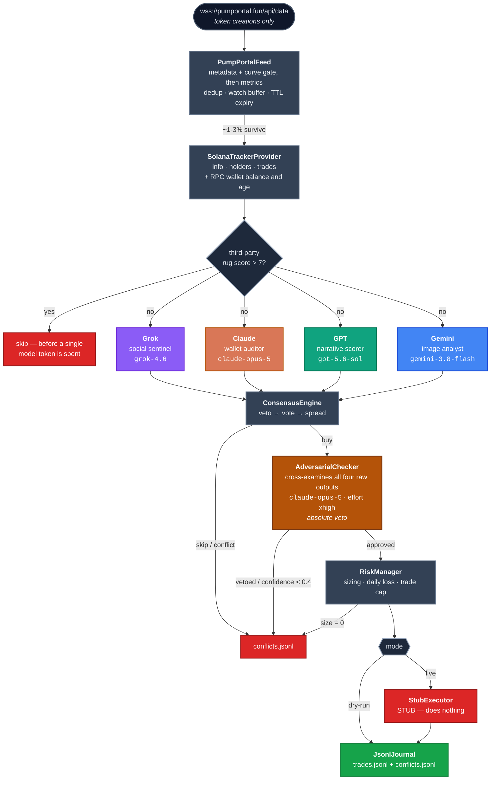
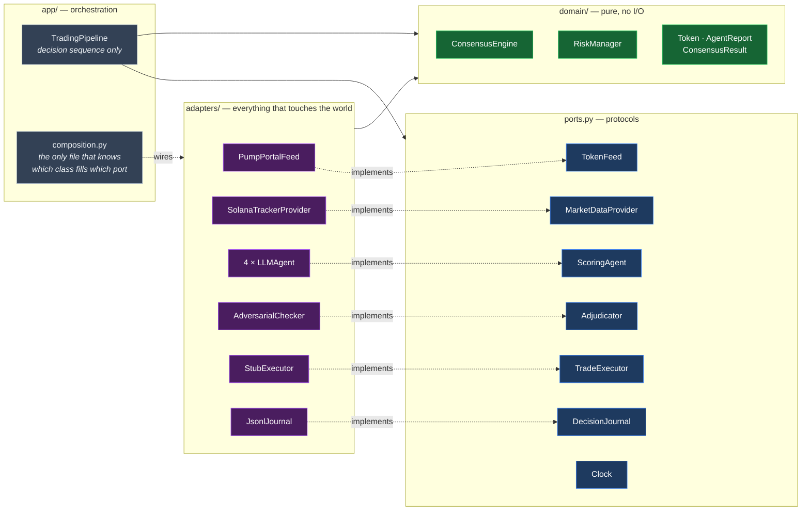
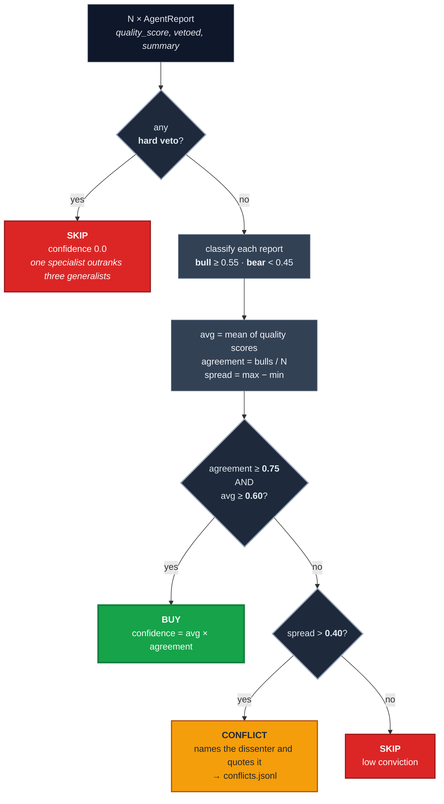
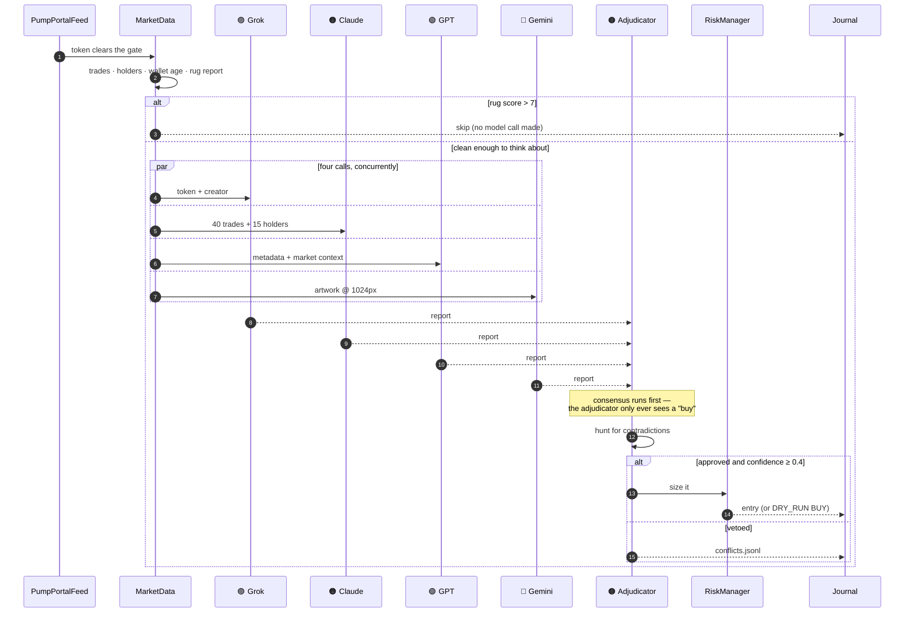
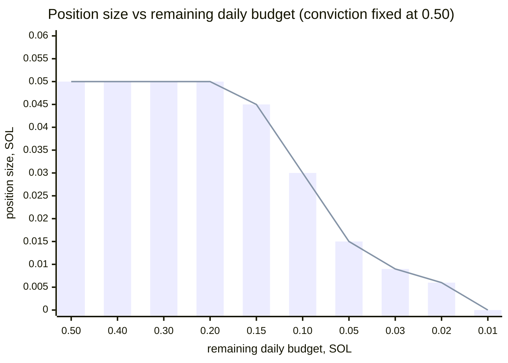

<div align="center">

# grok-claude-gpt-gemini-trading-desk

**Four frontier LLMs look at the same pump.fun launch from four angles they don't share.
A fifth is paid to talk them out of it.**

[](https://www.python.org/)
[](tests/)
[](pyproject.toml)
[](pyproject.toml)
[](LICENSE)

[](#the-panel)
[](#the-panel)
[](#the-panel)
[](#the-panel)
[](#the-panel)

</div>

---

A multi-model trading pipeline for pump.fun launches on Solana. It listens to the live
token-creation feed, filters new mints down to the few worth thinking about, and asks four
different frontier models — Grok, Claude, GPT and Gemini — to examine the *same* launch
from four angles they do not share: social chatter, on-chain wallet forensics, narrative
quality, and the artwork itself.

Their scores go to a consensus engine where any single specialist holds a veto. A surviving
"buy" is handed to a fifth call — an adversarial adjudicator whose only job is to find
contradictions between the other four and stop the trade. Every buy, every skip, every
disagreement is written to JSONL, so you can go back and ask the only question that matters
about this design: **was the fourth model worth a fourth API call?**

`adapters/execution/stub.py` is a stub. This is a research harness, not a bot that will
trade for you.

## Architecture

Two views. The first is the decision flow; the second is the dependency structure that
keeps it honest.



### Ports and adapters

Every arrow crosses a protocol in [`ports.py`](src/trading_desk/ports.py). The domain is
pure — a test asserts it imports no HTTP client and no model SDK — and the orchestrator
depends only on the ports, never on a provider.



The practical test of that structure: **adding a fifth seat to the panel is one line in
`composition.py` and zero lines in `pipeline.py`.** There is a test that proves it —
[`test_adding_a_fifth_seat_needs_no_pipeline_change`](tests/unit/app/test_pipeline.py).

## Where launches die

Gates are ordered by cost, so the free checks run before the paid ones. Percentages are
the shape of the funnel, not a measured backtest; the thresholds are real, from
`config.example.yaml`.

```mermaid
flowchart LR
    A["<b>every new mint</b><br/>live WebSocket"]:::s0
    B["<b>metadata + curve</b><br/>free — no API call<br/><code>require_metadata</code><br/><code>max_curve_pct 40</code>"]:::s1
    C["<b>traction metrics</b><br/>1 API call each<br/><code>min_buyers 5</code><br/><code>min_volume_sol 0.5</code>"]:::s2
    D["<b>rug report</b><br/><code>max_rug_score 7</code>"]:::s3
    E["<b>the panel</b><br/>4 model calls"]:::s4
    F["<b>adjudicator</b><br/>5th call"]:::s5
    G["<b>sized entry</b>"]:::s6

    A -->|"100%"| B
    B -->|"~25%"| C
    C -->|"~1-3%"| D
    D --> E --> F --> G

    classDef s0 fill:#0f172a,stroke:#475569,color:#e2e8f0
    classDef s1 fill:#1e3a5f,stroke:#3b82f6,color:#fff
    classDef s2 fill:#1e4620,stroke:#22c55e,color:#fff
    classDef s3 fill:#4a3410,stroke:#f59e0b,color:#fff
    classDef s4 fill:#4a1d5f,stroke:#a855f7,color:#fff
    classDef s5 fill:#5a2d0c,stroke:#f97316,color:#fff
    classDef s6 fill:#166534,stroke:#22c55e,stroke-width:3px,color:#fff
```



That ordering is why this is affordable to run at all: roughly three quarters of launches
are rejected before anything is billed.

## Quick start

```bash
git clone https://github.com/zostaff/grok-claude-gpt-gemini-trading-desk
cd grok-claude-gpt-gemini-trading-desk

python3 -m venv .venv && source .venv/bin/activate
pip install -e ".[dev]"

cp config.example.yaml config.yaml
$EDITOR config.yaml          # fill in the credentials block

trading-desk run --dry-run
```

Credentials can come from the environment instead, so nothing secret is written to disk:

```bash
export SOLANA_TRACKER_KEY=... XAI_API_KEY=... ANTHROPIC_API_KEY=... \
       OPENAI_API_KEY=... GOOGLE_API_KEY=...
trading-desk run --dry-run
```

If a key is missing or still holds a `YOUR_` placeholder, the pipeline refuses to start and
names **every** offending key at once. It never silently skips a seat.

Afterwards, read back what the panel actually did:

```bash
trading-desk analyse
pytest && ruff check . && mypy
```

## The panel

| | Agent | Model | Reads | Quality scores | Hard veto when |
|---|---|---|---|---|---|
| 🟣 | `GrokSocialSentinel` | `grok-4.6` | Live X, via the **`x_search` server-side tool** | `mention_velocity` · `whale_signal` · `sentiment_tone` · `source_quality` | `coordinated_shilling > 0.7` |
| 🟠 | `ClaudeWalletAuditor` | `claude-opus-5` | First 40 trades and top 15 holders, each wallet enriched with SOL balance and age | `organic_score` | `dump_risk > 0.8` **or** `coordination_score > 0.8` |
| 🟢 | `GPTNarrativeScorer` | `gpt-5.6-sol` | Name, symbol, description, socials, plus market context refreshed every 15 min | `narrative_fit` · `virality` · `originality` · `community_signal` · `name_quality` | never — a weak meme is not a rug |
| 🔵 | `GeminiImageAnalyst` | `gemini-3.8-flash` | The token artwork, downloaded and re-encoded at 1024px | `image_quality` · `meme_strength` · `effort_signal` · `originality_visual` | `red_flag_visual > 0.7` |
| 🟤 | `AdversarialChecker` | `claude-opus-5` @ `xhigh` | All four seats' raw output, side by side | — | any contradiction it can name |

Each seat is there because it sees something the others cannot. Grok has first-party X
access; Gemini can look at the picture; Claude reads wallet tables as forensics; GPT judges
the idea. A seat that duplicates another's view is a cost, not a vote — which is exactly
what `trading-desk analyse` is built to expose.

> **Grok's live access is not implicit.** xAI moved live retrieval behind server-side
> tools, so a model merely *asked* to "search X" answers from its weights. This repo
> declares `tools: [{"type": "x_search"}]` explicitly. That one line is the difference
> between a social sentinel and a model confidently hallucinating engagement metrics.

## How the panel decides



The ordering is the design. A hard veto short-circuits **before** averaging, because a rug
flagged by one specialist must not be outvoted by three generalists who liked the picture.

## One token, end to end



## Risk management

| Setting | Default | Meaning |
|---|---|---|
| `max_position_sol` | `0.1` | Hard ceiling on any single entry |
| `min_position_sol` | `0.005` | Below this, don't bother |
| `daily_loss_limit_sol` | `0.5` | Trading halts for the day when reached |
| `max_daily_trades` | `10` | Halts on count too, not just loss |
| `max_open_positions` | `3` | Concurrency cap |
| `stop_loss_pct` / `take_profit_pct` | `50` / `100` | Exit triggers (executor stub) |

Sizing is `max_position_sol × (avg_score × final_confidence)`, then capped at **30% of what
is left** of the daily loss budget.

### A losing session shrinks its own positions

Same conviction (`0.50`) at every point — only the remaining daily budget changes. These
numbers are computed by running `RiskManager` itself, not by hand:



| remaining budget | 30% cap | position size | |
|---:|---:|---:|---|
| 0.500 | 0.1500 | **0.0500** | conviction binds |
| 0.200 | 0.0600 | **0.0500** | conviction binds |
| 0.150 | 0.0450 | **0.0450** | ← budget starts binding |
| 0.100 | 0.0300 | **0.0300** | budget binds |
| 0.050 | 0.0150 | **0.0150** | budget binds |
| 0.020 | 0.0060 | **0.0060** | budget binds |
| 0.010 | 0.0030 | **0.0000** | ← cap fell under `min_position_sol`, trade skipped |

The cliff at the bottom is deliberate. When the remaining budget cannot cover even the
minimum position, `position_size` returns `0.0` and the caller treats it as *do not trade*,
never as a rounding artefact. A bad day ends by starving itself, not by doubling down.

## Three design decisions worth arguing with

**1. Risk scores are never averaged into the aggregate.** `dump_risk`,
`coordinated_shilling`, `red_flag_visual`, `coordination_score`, `wash_trading` and
`fresh_wallet_pct` all mean "high is worse". Averaging them with quality scores would let a
beautiful picture cancel out a rug warning, so each agent declares `quality_keys` and
`risk_keys` separately; only the former forms the aggregate. Enforced in three places: the
base class computes it, a contract test asserts the sets are disjoint, and a unit test
asserts a maxed risk key cannot raise a quality score.

**2. Failure is pessimistic; absence of data is not.** A provider that times out yields
that agent's worst-case scores — a blind analyst must not read as a clean bill of health.
But a launch that simply shipped without artwork scores zero *without* a veto, via an
explicit `neutral_exceptions` hook. Collapsing those two cases into one would veto every
launch with no picture.

**3. The adjudicator fails closed.** If the fifth call errors out, the trade is vetoed, not
approved. The entire point of that seat is to stand between a confident panel and a bad
trade; if it could not run, that thing was not there.

## Layout

```
src/trading_desk/
  ports.py         the protocols every component is written against
  domain/          pure rules: token, reports, consensus, risk, clock — no I/O
  adapters/        feed · market · agents · execution · journal
  app/             pipeline.py (sequence only) + composition.py (the wiring)
  config/          frozen, validated settings + loader
  analysis.py      post-run: who dissents, who vetoes, who is dead weight
docs/specs/        one spec per component: contract, failure policy, what's untested
tests/
  unit/            domain · adapters · config · app
  contract/        every adapter must satisfy the port it claims
```

Component contracts live in [`docs/specs/`](docs/specs/) — each names its port, its
invariants, the failure mode it is required to choose, and **what it does not cover.**

## What is not covered

Stated plainly, because a review will find it anyway:

- **No provider call has ever been executed.** This is the real gap. Every request shape
  — the xAI `x_search` tool, the OpenAI Responses `parse`, the Anthropic `output_config`,
  the google-genai vision call — was written from current vendor documentation and has not
  been run against a funded key. Everything *around* those calls is tested against fakes;
  the calls themselves are unverified.
- **The executor is a stub.** Four functions in `adapters/execution/stub.py` return
  correctly-shaped dicts and do nothing. Implement and audit them yourself before
  `mode: live` means anything.

Everything else has tests: the socket (frames, reconnect, re-subscribe, backoff), the
response parsers, the RPC enrichment, the gate, consensus, sizing, the journal, config
loading, the orchestrator against fake ports, the analysis report, and the CLI.

## A note on four models

Four models agreeing is not four independent confirmations. They share training data, they
share blind spots, and they will confidently agree with each other about a token that is
about to go to zero. The adjudicator exists precisely because consensus among language
models is much weaker evidence than it appears — and `trading-desk analyse` exists so you
can check whether any given seat ever changed an outcome, or was just an expensive fifth
opinion.

## License

MIT — see [LICENSE](LICENSE).
